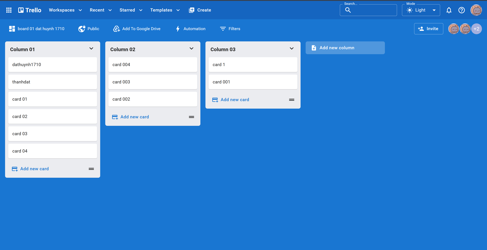

# Trello Web

Một ứng dụng web kanban lấy cảm hứng từ Trello, được xây dựng bằng các công nghệ ReactJS và MUI. Đây là project cá nhân nhằm học tập, thực hành và thể hiện kỹ năng lập trình giao diện người dùng.

---

## Tính Năng

- Thiết kế UI bằng Material UI (MUI)
- Responsive, hoạt động tốt trên desktop và tablet
- Giao diện hiện đại, đơn giản, dễ sử dụng
- Sử dụng thư viện Dnd-kit để kéo thả mượt mà
- CRUD **Board, Column, Card**.

## Công Nghệ Sử Dụng

- **React** – Xây dựng giao diện người dùng
- **Vite** – Bundler nhanh cho phát triển và build
- **MUI** – Thiết kế và bố cục giao diện
- **Dnd kit** – Thư viện kéo thả
- **Vercel** – Triển khai và hosting frontend
- **API** – Sử dụng từ [https://trello-api-4mi7.onrender.com](https://trello-api-4mi7.onrender.com) (phát triển bởi [dathuynh1710](https://github.com/dathuynh1710))

---

## Hình Ảnh Minh Họa



---

## Bắt Đầu Sử Dụng

### 1. Clone repo

```bash
git clone https://github.com/dathuynh1710/trello-web.git
cd trello-web
```

### 2. Cài đặt thư viện

```bash
yarn install
```

### 3. Khởi chạy dự án

```bash
yarn dev
```

---

## Tác Giả

- **Dat Huynh** – [GitHub](https://github.com/dathuynh1710)

Đây là một dự án học tập cá nhân, lấy cảm hứng từ [Trello](https://trello.com/)
